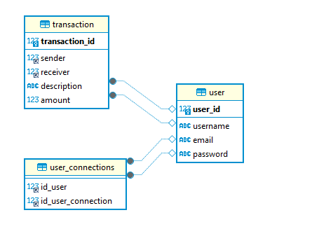

# projet_6_PayMyBuddy

Here's a screenshot of Pay My Buddy's physical database model. 
Screenshot taken from the DBeaver database management application.

The back-end folder contains all the Spring applications needed to run the back-end of the PayMyBuddy application.
The front-end is packaged with a build version in the resources/static folder, so that both applications run on the same server.
To connect to the database with Spring Data, simply create an .env file with the variable names set up in the application.properties file, and enter your connection informations.

The front-end folder contains the entire React application for the user interface part of the Pay My Buddy application.

The sql data folder groups together a file for generating the database structure and another sql file for adding data to the database.